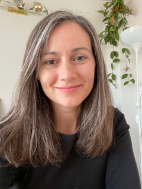
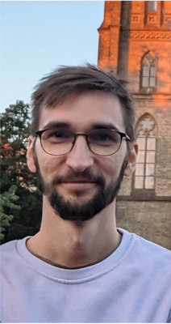
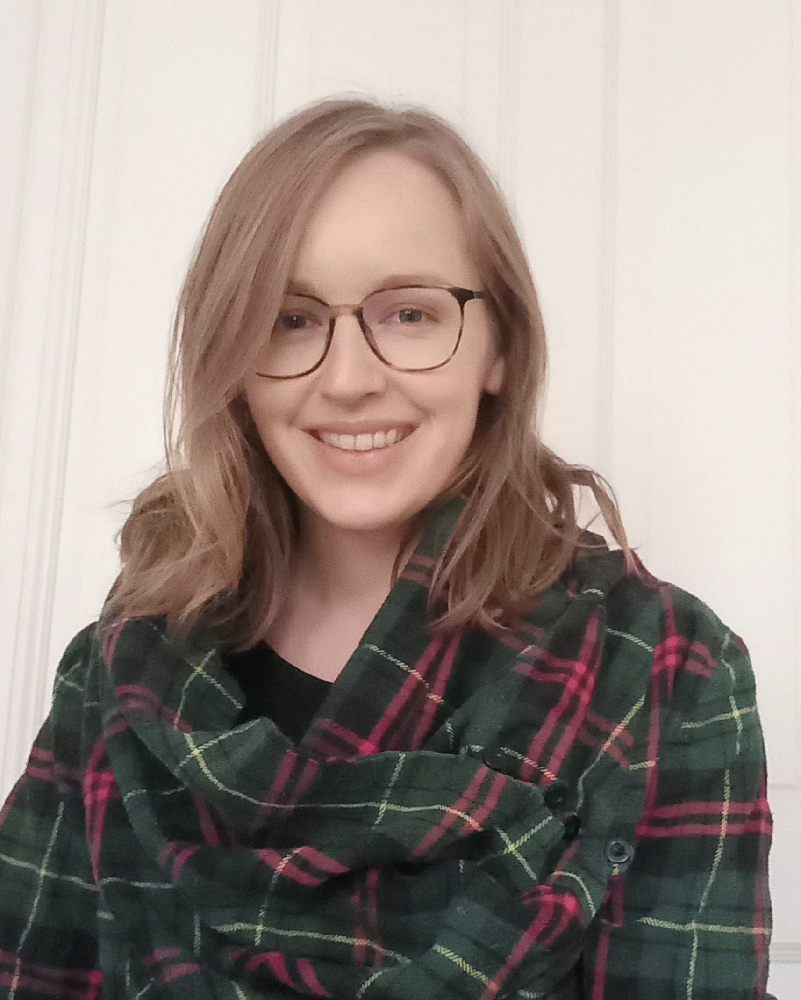
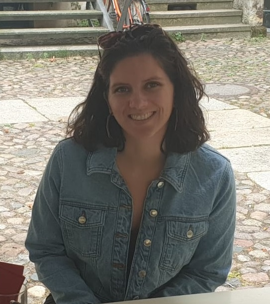
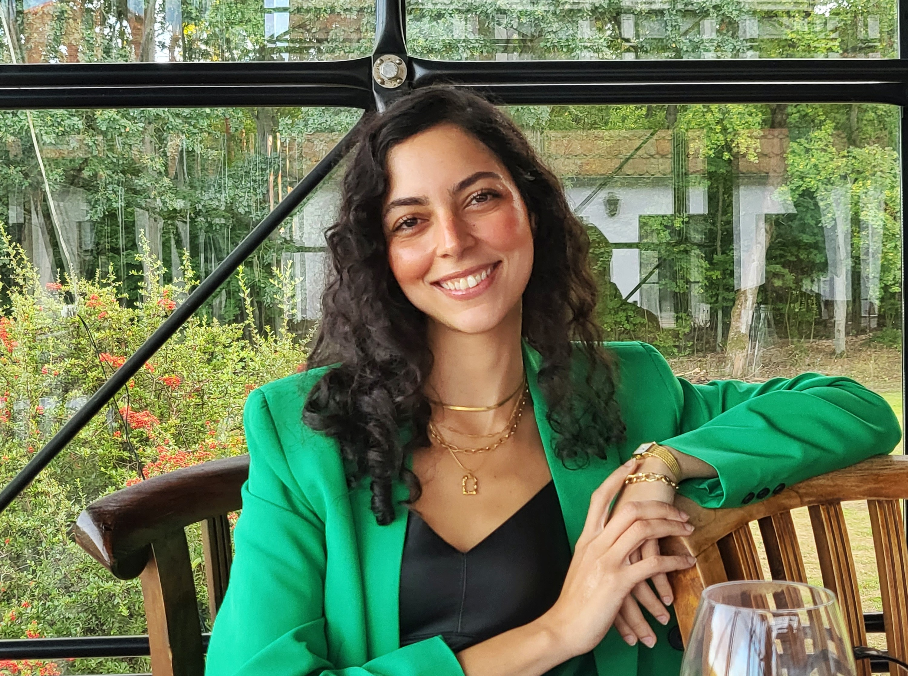
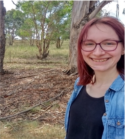
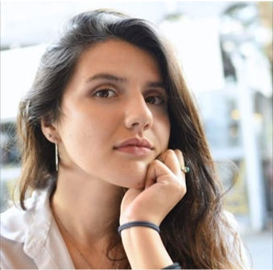
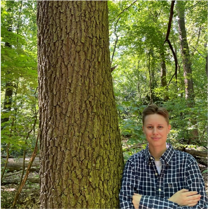
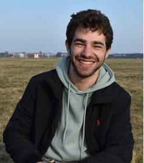

[To Main page](https://valentinatretti.github.io/)

## Audrey Bürki

### Short Bio
I obtained my PhD in 2010, then worked as a post-doctoral researcher at the Universities of York, Geneva, and Marseille, and as a lecturer in Methodology and data analysis in Geneva. I arrived in Potsdam in October 2016 to start a research group with a focus on cognitive science and applied statistics. 

### Research interests

My research combines a theoretical interest for the cognitive architecture of the language production system and a methodological interest for the paradigms and statistical tools that allow collecting and analyzing the relevant data. It combines theoretical models and methods from different fields, including linguistics (phonetic sciences, phonology), experimental psychology, statistics, and cognitive neurosciences (i.e., ERPs). I am particularly interested in inter-individual behavior.
Common underlying themes and goals in my research projects are (1) how to extend the description of language planning processes so that it accounts for language as it is spoken and learned in every day contexts (i.e., towards an ecological model of language production) (2) how to apply state-of-the-art tools in statistics to make the most of empirical data and (3) how to best describe and model the acquisition of new linguistic knowledge. 

#### Other websites

https://www.researchgate.net/profile/Audrey_Buerki 

https://osf.io/c6v0t/

#### [Publications](https://audreyburki.github.io/Publication-list/)  

#### [Third-party funded projects](https://audreyburki.github.io/Funded-research-projects/) 

-------------------------------------------------------------
## Pamela Fuhrmeister (Post-doc)

#### Short Bio
I received my PhD in Speech, Language, and Hearing Sciences in July 2020 from the University of Connecticut in the United States. Since then, I’ve been a postdoc in the Cognitive Science: Language and Methods lab, and I am working on the SFB project B05, Variability in speech planning. 

#### Research Interests
Broadly, I’m interested in both how we as humans speak and how we understand the speech we hear in the world. More specifically, my work focuses on the perceptual learning of unfamiliar speech sounds (for example, speech sounds in an unfamiliar language) and how phonetic variability in the speech signal can affect learning and memory for those sounds. Another line of my work seeks to better understand individual differences in speech perception and production by testing whether language ability, cognitive skills, or individual variation in brain structure (using MRI) predict individual differences in performance on speech tasks.

[https://pamfuhrmeister.github.io/index.html](https://pamfuhrmeister.github.io/)

[osf.io/m5ezq](osf.io/m5ezq)
 

-------------------------------------------------------------
## Filip Nenadić (Post-doc)

#### Short Bio
I obtained B.A. and M.A. degrees in Psychology and in Comparative Literature at the University of Novi Sad. I completed my PhD at the Department of Linguistics, University of Alberta. During my PhD studies, I also received some valuable experience from short visits to Dalhousie University, Eberhard Karl University of Tübingen, and University of Birmingham. After my PhD, I worked as a docent at the Faculty of Media and Communications, Singidunum University. Now I am at the University of Potsdam, working on a project led by Dr. Audrey Bürki in which we attempt to explain how our cognitive system handles phrase production.

#### Research Interests
My research mostly focuses on spoken word recognition and, as of recently, production. Besides that, I conduct empirical research in the field of literary reading. I enjoy a degree of variety, too, and you can find out about most of my work on my website.

[https://filipnenadic.netlify.app/)

 -------------------------------------------------------------
## Marie Hansen (PhD student)  

#### Short Bio

I obtained a B. Sc. in Logopedics with a focus on Neurosciences and Health Psychology in Hamburg in 2017. In the course of the International Experimental and Clinical Linguistics master’s program in Potsdam, my core interest gradually shifted from Clinical Linguistics to Psycholinguistics/ Cognitive Linguistics. I finished my M. Sc. in 2021, focusing on individual variability in the perception of prosodic cues in disambiguating prosody. Hereafter, I contributed to some more experimental work on prosodic cue production in the Neurocognition of Language lab at Potsdam University until I joined the Cognitive Science: Language and Methods lab as a PhD student.

#### Research Interests

In my research, I capitalize on acoustical and durational features of speech to gain insights into the underlying cognitive processes of speech and language.  In my PhD project, I am focusing on planning processes in word and short utterance production. I also have a pronounced interest in statistical methods and Open Science.

[https://www.researchgate.net/profile/Marie-Hansen-3osf.io/m53jh)

 -------------------------------------------------------------
## Solveig Castelli (PhD student)  

### Short bio:
I completed my BA in Spanish and Linguistics with a minor in Speech, Language and Hearing sciences in 2016 at Boston University. I then did my Msc in Clinical Linguistics at the joint European Master’s program in Clinical Linguistics (University of Eastern Finland, University of Groningen and the University of Potsdam). Following an internship in the Center for Language and Brain at the Higher School of Economics, I submitted my master thesis “A Collaborative Neural Substrate System behind Luria’s Efferent Motor Aphasia” in 2019 under the supervision of Prof. Roelien Bastiaanse and Dr. Olga Dragoy. I am now in the International Doctorate for Experimental Approaches to Language And Brain program doing my PhD with Prof. Audrey Bürki in the Cognitive Science: Language & Methods group (University of Potsdam) and Prof. Roel Jonkers and Dr. Srdjan Popov in the Neurolinguistics group (University of Groningen).

### Research interests:
My work currently focuses on the processing of words in sentence production in healthy speakers. More specifically, I am interested in investigating how different  factors such as hierarchical dependencies within phrases or transitional probabilities may have an effect on the preparation of words. I am also interested in statistical methods within both frequentist and Bayesian frameworks.

 -------------------------------------------------------------
## Shereen Elbuy (PhD Student)

#### Short bio  
In 2014 I obtained a B.A in Linguistics from Qatar University, and in 2019 I completed my M.Sc in Experimental and Clinical Linguistics at Universität Potsdam. Both of my theses mainly involved the investigation of word production in Arabic aphasia; specifically the role of different Arabic morphological properties during noun and verb retrieval. Upon completion of my M.Sc, I enrolled as a PhD candidate at the Cognitive Science: Language & Methods lab under the supervision of Audrey Bürki and Isabell Wartenburger. I am also recruited as a Research Assistant at the CSLM lab to assist with EEG and behavioural data collection and pre-processing, as well as in a meta-analysis of semantic interference effects in the picture word interference paradigm.

#### Research interests
I am interested in the role of language-specific features of Arabic on language production processes, more precisely I want to investigate the role of Arabic morphological properties during the semantic encoding of nouns in healthy speakers. I will do so using simple picture naming tasks and the Picture-Word-Interference (PWI) paradigm.

[https://www.researchgate.net/profile/Shereen_Elbuy)

 
-------------------------------------------------------------  
 
## Sabia Costantini (PhD student)

#### Short bio  
I obtained an MSc in Language Sciences – Neuroscience of Language in 2020 (University of Reading, UK). For my MSc thesis, I focussed on word production abilities in bilingual speakers with Alzheimer’s Disease. In 2020, I also welcomed my daughter. From 2021 to 2023, I worked as a research associate at Potsdam Research Institute for Multilingualism (University of Potsdam, Germany), where I explored inter-individual variability in language processing using EEG. In 2023, I enrolled as a PhD candidate at the Cognitive Science: Language & Methods lab under the supervision of Prof. Audrey Bürki, where I am researching co-occurrence frequency effects during utterance production in neurotypical individuals.

#### Research interests
I am very passionate about word production in neurotypical individuals and in individuals experiencing neurodegeneration. I like to look at the richness of word production data from different perspectives:  I employ word-production tests used in clinical settings to predict diagnosis of cognitive impairment in neurodegeneration with machine learning, alongside scrutinising differences in lexical representation in neurodegenerative diseases using semantic network analysis.

-------------------------------------------------------------
 
# Research Assistants
-------------------------------------------------------------
## Agniezka Bien (Research Assistant)

#### Short bio  
I finished my B.A. in Swedish Philology at Jagiellonian University in Krakow in 2017 and I obtained a M.A. in Scandinavian Studies at Humboldt-Universität in Berlin in 2020. Having discovered my interest in linguistics beyond the Scandinavian languages I am currently studying in the MSc programme Linguistics: theoretical and empirical foundations at Universität Potsdam and I am a research assistant in Prof. Dr. Audrey Bürki’s lab.

-------------------------------------------------------------
## Doris Jovovic (Research Assistant)

#### Short bio  
In 2019, I received my BA in English Language and Literature from the University of Montenegro. Currently, I am undertaking an MSc in Linguistics: Empirical and Theoretical Foundations at Potsdam University, focusing on syntax and semantics in both empirical and theoretical contexts. I am profoundly interested in understanding the intricacies of syntactic structures across languages and exploring the variability these structures exhibit. My fascination extends to the domains of language comprehension and production, especially concerning the role of semantic-syntactic integration during sentence processing. I aspire to help bridge the gap between theoretical linguistics and empirical/psycholinguistics, bringing forth an integrative perspective that enriches our understanding of the dynamism of languages.

#### Research interests
My research interests encompass the fields of syntax, semantics, and psycholinguistics. I am intrigued by the ways in which syntactic nuances and semantic structures influence the comprehension and production of language. More specifically, I aim to investigate the role of word order, grammatical roles, and semantic relations in shaping the syntactic structure of a sentence and how these structures are processed in real-time during language comprehension and production. 

-------------------------------------------------------------
## Julia Pantelmann  (Research Assistant)

#### Short bio  
In 2015, I received a B.A. in Archeology and Cultural Science as well as Scandinavian Studies at the Humboldt-University of Berlin. In the course of these studies, I have re-discovered my excitement for languages and decided to obtain a B.A. in Historical and Germanistic Linguistics in Berlin and Gothenburg. While being part of Leibniz-Zentrum Allgemeine Sprachwissenschaft, I gained initial experience in psycholinguistic research, primarily using the eye-tracking technique. Currently, I am pursuing the M.Sc. Linguistics: Empirical and Theoretical Foundations at the University of Potsdam and am supporting the Cognitive Science: Language and Methods lab, led by Prof. Dr. Audrey Bürki as a research assistant. 

#### Research interests
In my master thesis, I am currently investigating the relationship between orthography and phonology. In particular, I would like to gain more insight into the potential influence of the visual representation of language on the initial stage of L2/Ln speech acquisition, using acoustic analyses. Despite of my interest in diverging grapheme-phoneme mappings of modern languages, I am still very much intrigued by their diachronic character, which in turn is also reminiscent in the respective orthographic and phonological/phonetic dimension. 

-------------------------------------------------------------
## Laura Riedel (Research Assistant)

#### Short bio  
After finishing my B.A. in Linguistics at the Leipzig University in 2021 I enrolled in the M.Sc. Cognitive Systems: Language, Learning and Reasoning programme at the University of Potsdam. During my time in Leipzig I worked as a student assistant for the Language Cycles research group at the Max Planck Institute for Human Cognitive and Brain Sciences, and now in Potsdam I joined the Cognitive Science: Language and Methods lab as a research assistant.

#### Research interests
I'm generally interested in exploring cognitive aspects of language. My curiosity is sparked by a range of topics, including the (structural) relation of language and the brain, language development and differences in language acquisition, and language comprehension and production (also considering non-linguistic cues).

-------------------------------------------------------------
## Emanuele de Rossi  (Research Assistant)

#### Short bio  
In 2021 I completed my bachelor in Foreign Languages and Linguistics at the University of Venice, Italy, where I studied Portuguese and English. I'm currently at my second year of the Master's program "Cognitive Systems" at the University of Potsdam, an insterdisciplinary program that combines topics of Machine Learning and Computational Linguistics. I am currently working as a student assistant in Dr. Audrey Bürki's lab "Cognitive Science: Language & Methods".

#### Research interests
I decided to study at the Master's degree "Cognitive Systems" because, coming from a more linguistics background, I was fascinated by all the possibilities that computational models could offer to analyze, understand, and even produce language.

-------------------------------------------------------------
## Valentina Tretti (Research Assistant)

#### Short bio  

#### Research interests

-------------------------------------------------------------
## Radhika Yadav (Research Assistant)

#### Short bio  
I completed my bachelor’s in Computer Science in 2021 at VIT University in India. I am currently a master’s student in the Cognitive Systems: Language, Learning, and Reasoning program at the University of Potsdam. I also work as a research assistant at the Cognitive Science: Languages and Methods lab.

-------------------------------------------------------------

# Alumni 
Emiel van den Hoven (Post-doc)

