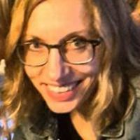
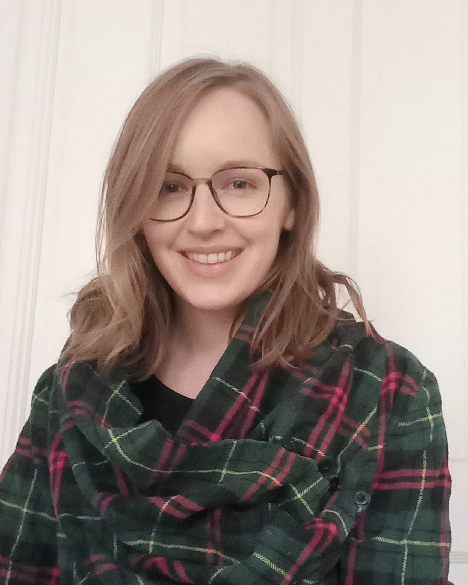

[To Main page](https://valentinatretti.github.io/)

## Audrey Bürki

### Short Bio
I obtained my PhD in 2010, then worked as a post-doctoral researcher at the Universities of York, Geneva, and Marseille, and as a lecturer in Methodology and data analysis in Geneva. I arrived in Potsdam in October 2016 to start a research group with a focus on cognitive science and applied statistics. 

### Research interests

My research combines a theoretical interest for the cognitive architecture of the language production system and a methodological interest for the paradigms and statistical tools that allow collecting and analyzing the relevant data. It combines theoretical models and methods from different fields, including linguistics (phonetic sciences, phonology), experimental psychology, statistics, and cognitive neurosciences (i.e., ERPs). I am particularly interested in inter-individual behavior.
Common underlying themes and goals in my research projects are (1) how to extend the description of language planning processes so that it accounts for language as it is spoken and learned in every day contexts (i.e., towards an ecological model of language production) (2) how to apply state-of-the-art tools in statistics to make the most of empirical data and (3) how to best describe and model the acquisition of new linguistic knowledge. 

#### Other websites

https://www.researchgate.net/profile/Audrey_Buerki 

https://osf.io/c6v0t/

#### [Publications](https://audreyburki.github.io/Publication-list/)  

#### [Third-party funded projects](https://audreyburki.github.io/Funded-research-projects/) 

-------------------------------------------------------------
## Pamela Fuhrmeister (Post-doc)

#### Short Bio
I finished my B.A. in German in 2009 and my M.A. in Applied Linguistics in 2011 at Texas Tech University. I received my PhD in Speech, Language, and Hearing Sciences in July 2020 from the University of Connecticut. I am now a postdoc in the Cognitive Science: Language and Methods lab, led by Dr. Audrey Bürki, and I am working on the SFB project B05, Variability and its limits in the time course of language production processes.

#### Research Interests
My research so far has focused on the perceptual learning of second-language speech sounds and how phonetic variability in the speech signal can affect learning and memory for those sounds. Another line of my work seeks to better understand individual differences in speech perception and learning of speech sounds by testing whether language ability, cognitive skills, or individual variation in brain structure (using MRI) predict individual differences in performance on perceptual speech tasks. I am now working on projects involving individual differences in cognitive skills and how these relate to word production.

[https://pamfuhrmeister.github.io/index.html](https://pamfuhrmeister.github.io/)

[osf.io/m5ezq](osf.io/m5ezq)
 

-------------------------------------------------------------
## Paula Lissón (Post-doc)

#### Short Bio
I finished my B.A. in English and French at the ULPGC, in Spain. I completed my M.A. in English Linguistics at the Université Paris Diderot and New York University in 2018. Between 2018 and 2021 I was a PhD student in the Vasishth Lab, at the University of Potsdam. I recently submitted my dissertation, entitled "Computational models of sentence comprehension in aphasia", and I am now part of the Cognitive Science: Language and Methods lab, led by Dr. Audrey Bürki. 

#### Research Interests
My current research focuses on modeling the cognitive mechanisms underlying the production of utterances in healthy native and non-native speakers. I use behavioral experiments and computational modeling to investigate the role of frequency and to test a new model of language production. I am generally interested in memory, multilingualism, langauge learning, and cognitive modeling.  During my PhD, I worked on developing Bayesian computational models of sentence processing in aphasia.

[https://paulalisson.github.io](https://paulalisson.github.io)

[https://osf.io/7d392/](https://osf.io/7d392/)

 -------------------------------------------------------------
## Marie Hansen (PhD student)  

Short bio:

I obtained a B. Sc. in Logopedics with a focus on Neurosciences and Health Psychology in Hamburg in 2017. In the course of the International Experimental and Clinical Linguistics master’s program in Potsdam, my core interest gradually shifted from Clinical Linguistics to Cognitive Linguistics/ Psycholinguistics. I finished my M. Sc. in 2021, focusing on individual variability in the perception of prosodic cues in disambiguating prosody. Hereafter, I contributed to some more experimental work on prosodic cue production in the Neurocognition of Language lab at Potsdam University until I enrolled as a PhD student in the Cognitive Science: Language and Methods lab.

Research interests:

In my research, I capitalize on acoustical and durational features of speech to gain insights into the cognitive architecture of speech and language. In my PhD project, I am focusing on word production processes and am currently investigating the relationship between cognitive planning and articulatory execution. I also have a pronounced interest in statistical methods, Open Science and science communication.

 -------------------------------------------------------------
## Solveig Castelli (PhD student)  

### Short bio:
I completed my BA in Spanish and Linguistics with a minor in Speech, Language and Hearing sciences in 2016 at Boston University. I then did my Msc in Clinical Linguistics at the joint European Master's program in Clinical Linguistics  (University of Eastern Finland, University of Groningen and the University of Potsdam). Following an internship in the Center for Language and Brain at the Higher School of Economics, I submitted my master thesis "A Collaborative Neural Substrate System behind Luria’s Efferent Motor Aphasia" in 2019 under the supervision of Prof. Roelien Bastiaanse and Dr. Olga Dragoy. I am now in the International Doctorate for Experimental Approaches to Language And Brain program doing my PhD with Dr. Audrey Bürki in the Cognitive Science: Language & Methods group (University of Potsdam) and Prof. Roel Jonkers and Dr. Srdjan Popov in the Neurolinguistics group (University of Groningen).

### Research interests:
My work currently focuses on the processing of verbs in sentence production in healthy speakers. More specifically, I am interested in investigating how different syntactic factors such as hierarchical dependencies within verb phrases may have an effect on verb planning during sentence production. I am also interested in statistical analysis within both frequentist and Bayesian frameworks. 

 -------------------------------------------------------------
## Ali Behzadnia (PhD student)

### Short bio:
I obtained my B.A. in 2013 and M.A. in 2017 in Iran. For my master’s theses, I investigated children’s interrogative suggestibility. In 2019, I started my PhD in the International Doctorate for Experimental Approaches to Language and Brain (IDEALAB) Program. I am doing my PhD under the supervision of Dr. Audrey Bürki at Potsdam University and Dr. Lisi Beyersmann at Macquarie University. I am currently in the Cognitive Science: Language and Methods lab, led by Dr. Audrey Bürki.

### Research interests:
I am interested in how words with different morphemes are learned and processed in a first and a second language. I am currently investigating novel word learning and processing in English as L1 and L2. Particularly, I am investigating learning and processing of written and orally trained morphologically complex words. 
 
-------------------------------------------------------------  
 
## Maria Korochkina (PhD student)

#### Short bio  
I obtained a diploma in Philology in 2015 (Lomonosov Moscow State University) and a M.Sc. in Experimental and Clinical Linguistics in 2018 (University of Potsdam). During my master studies, I have worked as a research assistant in various projects at NOLA and Vasishth labs involving fNIRS, EEG and eye-tracking.

#### Research interests
I am currently working on novel word learning in first and second language, and I am particularly interested in the impact of learning context on such aspects of word learning as explicit recall, semantic integration and between-language mapping. I aim to study this using both behavioral and electrophysiological methods. In addition, I have a keen interest in the role of memory and age-related processes in language learning. I am also very enthusiastic about statistics.

[https://mariakna.github.io](https://mariakna.github.io)

-------------------------------------------------------------
## Shereen Elbuy (PhD Student)

#### Short bio  
In 2014 I obtained a B.A in Linguistics from Qatar University, and in 2019 I completed my M.Sc in Experimental and Clinical Linguistics at Universität Potsdam. Both of my theses mainly involved the investigation of word production in Arabic aphasia; specifically the role of different Arabic morphological properties during noun and verb retrieval. Upon completion of my M.Sc, I enrolled as a PhD candidate at the Cognitive Science: Language & Methods lab under the supervision of Audrey Bürki and Isabell Wartenburger. I am also recruited as a Research Assistant at the CSLM lab to assist with EEG and behavioural data collection and pre-processing, as well as in a meta-analysis of semantic interference effects in the picture word interference paradigm.

#### Research interests
I am interested in the role of language-specific features of Arabic on language production processes, more precisely I want to investigate the role of Arabic morphological properties during the semantic encoding of nouns in healthy speakers. I will do so using simple picture naming tasks and the Picture-Word-Interference (PWI) paradigm.
Personal website: https://www.researchgate.net/profile/Shereen_Elbuy

-------------------------------------------------------------
 
# Research Assistants
Nikolay Dimitrov

# Alumni 
Emiel van den Hoven (Post-doc)

